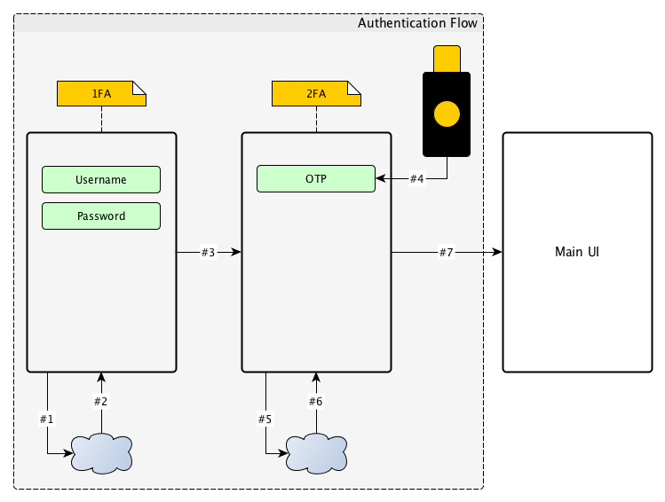
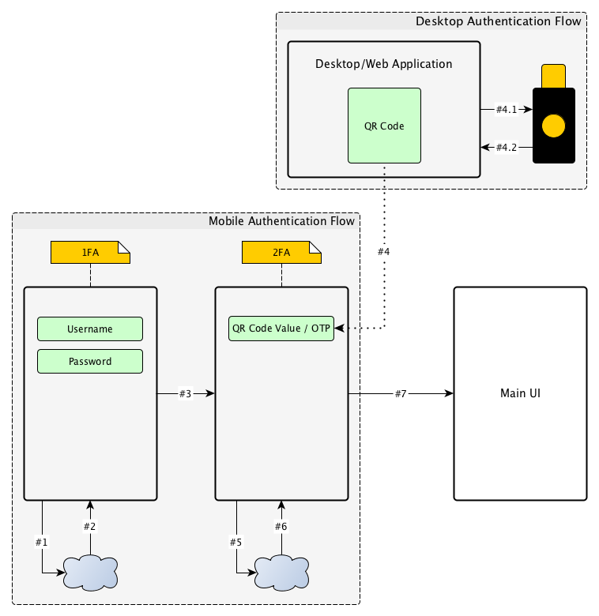
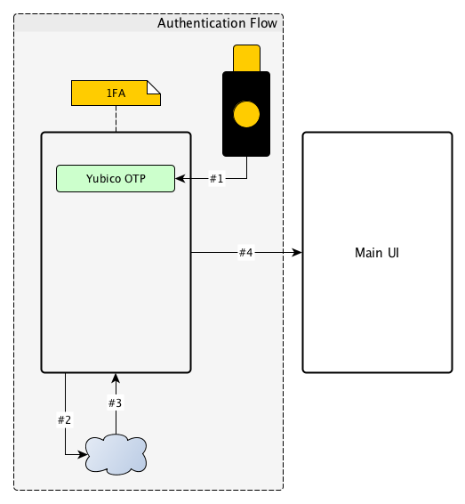
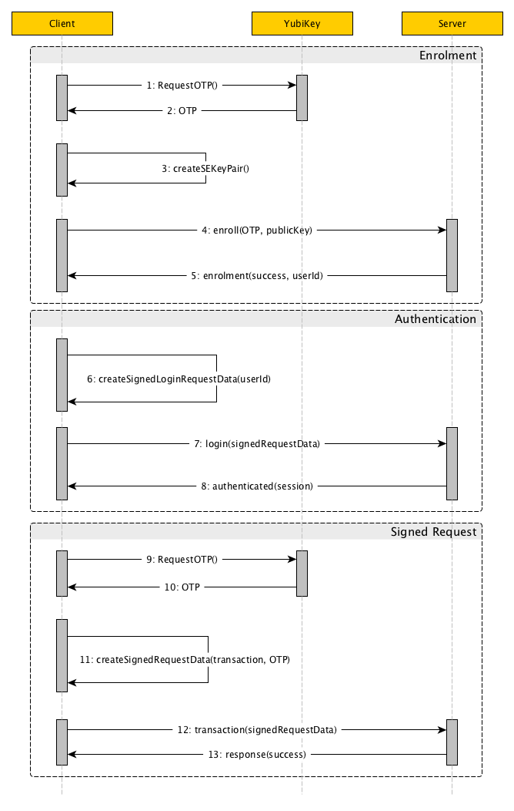

## Guidelines

This document was written to provide a few recommendations about integrating YubiKit and using YubiKeys with an iOS application for the purpose of strongly authenticating users.

This document is focused on iOS but some of these techniques may have analogies in other technologies as well.

## 1. Using OTPs for 2FA

The OTP received from the YubiKey can be used as a second verification method inside a [Two Factor Authentication (2FA)](https://en.wikipedia.org/wiki/Multi-factor_authentication) flow. In such a flow the OTP can replace traditional 2FA methods like SMS, security questions, hardware tokens etc. and provides a faster yet more secure way or verifying the user identity.



1. The user logs-in using the current way of authenticating against the system (#1 - request, #2 - response, #3 - navigate is #2 was successful). In this scenario the system has already an username/password login service.
2. The application asks for an OTP from the YubiKey using YubiKit (#4)
3. The application validates the OTP against the server (#5)
4. The application receives a session from the server (#6) and navigates to the main UI (#7).

Not all iOS devices support NFC reading. Some devices may have older versions of iOS or some may not have access to the NFC reading capability. To address such an issue, the enrolment flow can include a *desktop bridged* solution. In such a scenario a secret can be generated on a desktop app or website and send it to the application by encoding it into a QR code. YubiKit provides the ability to scan QR codes for this purpose. Consult the library documentation to find out how this can be done.



The authentication in this scenario is very similar with the NFC scanning. The only difference is on the second step of the authentication (#4) where the secret is generated on a desktop machine using a **YubiKey** (#4.1, #4.2). The requirement to use the YubiKey is important because the generation of the QR code should not be allowed unless the user is strongly authenticated.

To simplify the design, the desktop/web app can ask the user to authenticate with the YubiKey (OTP, U2F, etc.) and then use again the YubiKey to generate a OTP which is encoded in the QR Code. In this case a unified design for the enrolment APIs from the server can be used, where the OTP source is considered secure, as long as a YubiKey was used in the process.

## 2. Using Yubico OTP as 1FA

In some scenarios, using the [Yubico OTP](https://developers.yubico.com/OTP/) over other OTP types can reduce friction by creating more efficient authentication flows. The Yubico OTP is [more powerful](https://www.yubico.com/products/services-software/personalization-tools/yubikey-otp/) compared to other OTPs because it contains additional information about the device, like the Public ID. The Public ID can be used to perform a lookup for an account removing the initial step of entering the credentials. This scenario is limited to systems where the users already have an account and they can access the account by other means (like a web portal).

In such a system, when the user wants to add a 2FA authentication method to his account using a YubiKey, he/she may follow these steps:

1. The user logs-in into his online account.
2. The user enables the 2FA and selects the YubiKey as his 2FA method.
3. The user adds his NFC enabled YubiKey to his account and pairs the key with the Yubico OTP validation module from the server.

After following these steps, the server will be able to validate the Yubico OTPs received from the key for that specific account.

Next, when the user wants to enrol or authenticate using the mobile app, he/she can use directly the Yubico OTP for both identity lookup and authentication.



1. The application asks the user to scan the YubiKey.
2. The application reads the OTP from the YubiKey using YubiKit (#1).
3. The application validates the user identity agains the server by sending only the OTP to the server(#2).
4. The server receives the login request and derives from it the Public ID, finds the associated account and validates the OTP for that account (#2). 
5. The application receives a session from the server (#3) and navigates to the main UI (#4)

---

**Note** If the system allows for multiple 2FA methods, on a cold start (first run), the application may require a initial check for the available 2FA on the account and ask the user to provide his username or some other id. This value can then be cached and reused when the user starts again the application.

---

## 3. Using the YubiKey for one time enrolments

Some applications may have UX requirements where using always the YubiKey can be an impediment for the usability of the application. In a scenario where the application is used very often for a very short time, an enrolment mechanism involving the YubiKey can be used instead. On first run, the application asks the user to authorise/enrol the application using a YubiKey. The app requires again the usage of the YubiKey *on demand*, only when important requests are performed by the client.

To increase the security of this approach a *time limited enrolment* can be used, so the user needs to reauthorise the application every [X] days. Depending on the security requirements and the type of application [X] can be shorter or longer.

The application needs (not only in this scenario) to provide strong security when communicating with the server by taking advantage of the build-in APIs provided by iOS like [keychain services](https://developer.apple.com/documentation/security/keychain_services?language=objc), [local authentication framework](https://developer.apple.com/documentation/localauthentication?language=objc) and hardware features like the [Secure Enclave](https://developer.apple.com/documentation/security/certificate_key_and_trust_services/keys/storing_keys_in_the_secure_enclave?language=objc) and [Touch ID](https://developer.apple.com/videos/play/wwdc2014/711/).

The next diagram shows a possible enrolment solution, where the YubiKey is used only *on demand* when an important transaction is performed:



The enrolment process involves three major steps:

1. The application requests the OTP from the YubiKey (1, 2).
2. The application uses the Secure Enclave (SE) to create a key pair (3).
3. The application requests from the server to enrol the instance by passing the OTP (for enrolment validation) and the public key from the generated key pair at #2, for future communication (4, 5).

After the enrolment process is completed once, the application will be able to use the private key to generate a signature when communicating with the server. 

In case of login: 

1. The application can build a login payload which is signed with the SE (6). The SE will prompt for Touch ID or passcode to allow the payload to be signed. 
2. The application sends the payload to the server (7), which is using the enrolment public key to validate the authenticity of the request. If the signature is confirmed the client is allowed to login (8).

If the user requests an important operation from the server, the application needs to send a signed request with an OTP (Double verification policy - SE signature and YubiKey):

1. The application requests the OTP from the YubiKey (9, 10).
2. The transaction data together with the OTP is signed with the SE, using Touch ID (11).
3. The server receives the transaction request, validates the signature and then the OTP.

---

**Note** The sequence diagram is focusing on the combined use of the YubiKey and Secure Enclave and how these two techniques could be used to create signed requests on an iOS device. The actual implementation of a service could include additional parameters and steps to strengthen the communication security (nonces, timestamps, additional encryption, HTTPS-only requests, certificate pinning, etc.)

---

## 4. Strong authentication using FIDO U2F and FIDO2 

In some cases OTPs can provide better security compared with other 2FA methods but they are still prone to phishing attacks, and for some types of OTPs, to brute force attacks.

A modern and more secure approach is to use cryptographic keys which are harder to break using brute force attacks and they can be stored securely on dedicated hardware which is tamper-proof (such as the YubiKey). 

**It is always recommended to use this approach, when possible, over any OTP solution.**

Starting from version 2.0.0, YubiKit can interact with Yubico's **YubiKey 5Ci**, a security key design by Yubico for iOS devices. This security key allows an iOS application which is using YubiKit to access all the functionality provided by a regular YubiKey over USB. This opens the possibility to use stronger authentication protocols in native iOS application, like FIDO U2F and FIDO2. 

Both of these standards have extensive documentation and guidelines on the [FIDO Alliance](https://fidoalliance.org) portal.

Yubico also provides documentation, tools and libraries for both [FIDO U2F](https://developers.yubico.com/U2F/) and [FIDO2](https://developers.yubico.com/FIDO2/) on the Yubico Developers website.

## 5. Other protocols

The YubiKey 5Ci provides also the possibility to use PIV and OpenPGP. For more details about these protocols visit:

1. OpenPGP [documentation](https://developers.yubico.com/PGP/) on Yubico Developers.
2. PIV [documentation](https://developers.yubico.com/PIV/Introduction/YubiKey_and_PIV.html) on Yubico Developers.

## Appendix A - Using the Secure Enclave

*"The Secure Enclave is a coprocessor fabricated in the Apple T1, Apple S2, Apple S3, Apple A7, or later A-series processors. It uses encrypted memory and includes a hardware random number generator."* - *[iOS Security Guide]((https://www.apple.com/business/docs/iOS_Security_Guide.pdf))*

The Secure Enclave is accessible from iOS applications by using the keychain APIs, and provides the ability to generate internally cryptographic keys, without providing the private key data outside the circuit. As a side effect, the cryptographic operations involving the private key (such as signing) can be performed only by the Secure Enclave. 

The API allows a developer to specify access rules for the key, which include the local user presence and local authentication when performing cryptographic operations. 

The keys generated with the SE cannot leave the device, so they don't get backed-up in iCloud or by iTunes making them harder to reach by an attacker.

Apple provides some documents on how to use the Secure Enclave and the keychain APIs for cryptographic operations:

* [Storing Keys in the Secure Enclave](https://developer.apple.com/documentation/security/certificate_key_and_trust_services/keys/storing_keys_in_the_secure_enclave?language=objc)
2. [Keychain Services](https://developer.apple.com/documentation/security/keychain_services?language=objc)
3. [Crypto Exercise](https://developer.apple.com/library/content/samplecode/CryptoExercise/Introduction/Intro.html)

Next, the document contains some snippets on how to generate and sign some data using the Secure Enclave in Swift 4, to provide an example on how to use the Secure Enclave APIs.

### SecureEnclaveService

```swift
import Foundation
import Security

class SecureEnclaveService: NSObject {
    
	private var secureEnclaveKeyType: CFString {
        get {
            if #available(iOS 10, *) {
                return kSecAttrKeyTypeECSECPrimeRandom
            } else {
                return kSecAttrKeyTypeEC
            }
        }
    }
    
    // MARK: - Key lifecycle
    
    func createSecureEnclaveKeyPair(withIdentifier identifier: AsymmetricKeyIdentifier) throws {
        
        // .userPresence will force the user to enter TouchID or Passcode before using the key for crytographic operations like signing.
        let access = SecAccessControlCreateWithFlags(kCFAllocatorDefault, kSecAttrAccessibleWhenUnlockedThisDeviceOnly, [.privateKeyUsage, .userPresence], nil)!
        
        // Private key parameters
        let privateKeyParams: [String: Any] = [kSecAttrLabel as String: identifier.privateKeyTag,
                                               kSecAttrIsPermanent as String: true, // The private key is stored in the SE permanently
                                               kSecAttrApplicationTag as String: identifier.applicationTag,
                                               kSecAttrAccessControl as String: access]
        
        // Public key parameters
        let publicKeyParams: [String: Any] = [kSecAttrLabel as String: identifier.publicKeyTag,
                                              kSecAttrIsPermanent as String: true, // The public key is also stored permanently in the SE
                                              kSecAttrApplicationTag as String: identifier.applicationTag]
        // Parameters
        let parameters: [String: Any] = [kSecAttrKeyType as String: secureEnclaveKeyType,
                                         kSecAttrKeySizeInBits as String: 256,
                                         kSecAttrTokenID as String: kSecAttrTokenIDSecureEnclave,
                                         kSecPublicKeyAttrs as String: publicKeyParams,
                                         kSecPrivateKeyAttrs as String: privateKeyParams]
        
        var error: Unmanaged<CFError>?
        let privateKey = SecKeyCreateRandomKey(parameters as CFDictionary, &error)
        
        guard error == nil else {
            let returnedError = (error!.takeRetainedValue() as Error) as NSError
            throw SecureEnclaveError(withCode: returnedError.code)
        }
        assert(privateKey != nil)
    }
    
    func deleteSecureEnclaveKeyPair(withIdentifier identifier: AsymmetricKeyIdentifier) throws {
        let publicKeyQuery = queryForPublicKey(withIdentifier: identifier)
        let privateKeyQuery = queryForPrivateKey(withIdentifier: identifier)
        
        var status = SecItemDelete(publicKeyQuery as CFDictionary)
        guard status == errSecSuccess else {
            throw SecureEnclaveError(withCode: Int(status))
        }
        
        status = SecItemDelete(privateKeyQuery as CFDictionary)
        guard status == errSecSuccess else {
            throw SecureEnclaveError(withCode: Int(status))
        }
    }
    
    // MARK: - Public key
    
    func getPublicKey(forIdentifier identifier: AsymmetricKeyIdentifier) throws -> SecKey {
        let publicKeyQuery = queryForPublicKey(withIdentifier: identifier)
        
        var result: CFTypeRef?
        let status = SecItemCopyMatching(publicKeyQuery as CFDictionary, &result)
        
        guard status == errSecSuccess else {
            throw SecureEnclaveError(withCode: Int(status))
        }
        
        assert(result != nil)
        return result! as! SecKey
    }
	
    func getPublicKeyExternalRepresentation(forIdentifier identifier: AsymmetricKeyIdentifier) throws -> Data {
        let publicKeyQuery = queryForPublicKey(withIdentifier: identifier)
        
        var result: CFTypeRef?
        let status = SecItemCopyMatching(publicKeyQuery as CFDictionary, &result)
        
        guard status == errSecSuccess else {
            throw SecureEnclaveError(withCode: Int(status))
        }
        
        assert(result != nil)
        let key = result! as! SecKey
        
        var error: Unmanaged<CFError>?
        guard let keyData = SecKeyCopyExternalRepresentation(key, &error) as Data? else {
            let returnedError = (error!.takeRetainedValue() as Error) as NSError
            let secureEnclaveError = SecureEnclaveError(withCode: returnedError.code, description: returnedError.localizedDescription)
            throw secureEnclaveError
        }
        
        return keyData
    }
    
    func isPublicKeyAvailable(forIdentifier identifier: AsymmetricKeyIdentifier) -> Bool {
        let publicKeyQuery = queryForPublicKey(withIdentifier: identifier)
        
        var result: CFTypeRef?
        let status = SecItemCopyMatching(publicKeyQuery as CFDictionary, &result)
        
        return status == errSecSuccess
    }
    
    // MARK: - Private key
    
    func getPrivateKey(forIdentifier identifier: AsymmetricKeyIdentifier) throws -> SecKey {
        let privateKeyQuery = queryForPrivateKey(withIdentifier: identifier)
        
        var result: CFTypeRef?
        let status = SecItemCopyMatching(privateKeyQuery as CFDictionary, &result)
        
        guard status == errSecSuccess else {
            throw SecureEnclaveError(withCode: Int(status))
        }
        
        assert(result != nil)
        return result! as! SecKey
    }
    
    // MARK: - Signature
    
    func sign(data: Data, withKeyIdentifier identifier: AsymmetricKeyIdentifier) throws -> Data {
        let privateKey = try getPrivateKey(forIdentifier: identifier)
        
        var error: Unmanaged<CFError>?
        let signature = SecKeyCreateSignature(privateKey, .ecdsaSignatureMessageX962SHA256, data as CFData, &error) as Data?
	
        guard error == nil else {
            let returnedError = (error!.takeRetainedValue() as Error) as NSError
            throw SecureEnclaveError(withCode: returnedError.code, description: returnedError.localizedDescription)
        }
        
        guard signature != nil else {
            throw SecureEnclaveError(withCode:Int(errSecItemNotFound))
        }
        
        assert(signature != nil)
        return signature!
    }
    
    func verifySignature(data: Data, signatureData: Data, withKeyIdentifier identifier: AsymmetricKeyIdentifier) throws -> Bool {
        let publicKey = try getPublicKey(forIdentifier: identifier)
        
        var error: Unmanaged<CFError>?
        let status = SecKeyVerifySignature(publicKey, .ecdsaSignatureMessageX962SHA256, data as CFData, signatureData as CFData, &error)
	
        guard error == nil else {
            let returnedError = (error!.takeRetainedValue() as Error) as NSError
            throw SecureEnclaveError(withCode: returnedError.code, description: returnedError.localizedDescription)
        }
                
        return status
    }
        
    // MARK: - Query
    
    private func queryForPublicKey(withIdentifier identifier: AsymmetricKeyIdentifier) -> [String: Any] {
        let publicKeyQuery: [String: Any] = [kSecClass as String: kSecClassKey,
                                             kSecAttrKeyType as String: secureEnclaveKeyType,
                                             kSecAttrApplicationTag as String: identifier.applicationTag,
                                             kSecAttrLabel as String: identifier.publicKeyTag,
                                             kSecAttrKeyClass as String: kSecAttrKeyClassPublic,
                                             kSecReturnRef as String: true]
        return publicKeyQuery
    }
    
    private func queryForPrivateKey(withIdentifier identifier: AsymmetricKeyIdentifier) -> [String: Any] {
        // Note: If the dictionary has the (kSecReturnData as String: true) flag enabled when debugging
        // the private key data should be empty because it should not be accessible ouside the SE.
        let publicKeyQuery: [String: Any] = [kSecClass as String: kSecClassKey,
                                             kSecAttrKeyType as String: secureEnclaveKeyType,
                                             kSecAttrApplicationTag as String: identifier.applicationTag,
                                             kSecAttrLabel as String: identifier.privateKeyTag,
                                             kSecAttrKeyClass as String: kSecAttrKeyClassPrivate,
                                             kSecReturnRef as String: true]
        return publicKeyQuery
    }
}
```

### AsymmetricKeyIdentifier

```swift
import Foundation
	
public class AsymmetricKeyIdentifier: NSObject {
    
    static let privateSuffix = "Private"
    static let publicSuffix = "Public"
    static let appSuffix = "App"
    
    private(set) var privateKeyTag: String
    private(set) var publicKeyTag: String
    private(set) var applicationTag: String
    
    init(privateKeyTag prKeyTag: String, publicKeyTag pbKeyTag:String, applicationTag appTag:String) {
        assert(prKeyTag.count > 0)
        assert(pbKeyTag.count > 0)
        assert(appTag.count > 0)
        
        privateKeyTag = prKeyTag
        publicKeyTag = pbKeyTag
        applicationTag = appTag
        
        super.init()
    }
    
    convenience init(withLabel label: String) {
        assert(label.count > 0)
        
        let privateKeyTag = label + AsymmetricKeyIdentifier.privateSuffix
        let publicKeyTag = label + AsymmetricKeyIdentifier.publicSuffix
        let applicationTag = label + AsymmetricKeyIdentifier.appSuffix
        
        self.init(privateKeyTag: privateKeyTag, publicKeyTag: publicKeyTag, applicationTag: applicationTag)
    }
}
```

### SecureEnclaveError

```swift	
import Foundation
	
public class SecureEnclaveError: NSError {
    
    public static let SecureEnclaveErrorDomain = "SecureEnclaveError"
    
    public init(withCode code: Int, description: String) {
        super.init(domain:SecureEnclaveError.SecureEnclaveErrorDomain , code: code, userInfo: [NSLocalizedDescriptionKey : description])
    }
    
    convenience init(withCode code: Int) {
        self.init(withCode: code, description: "")
    }
    
    public required init?(coder aDecoder: NSCoder) {
        super.init(coder: aDecoder)
    }
}
```