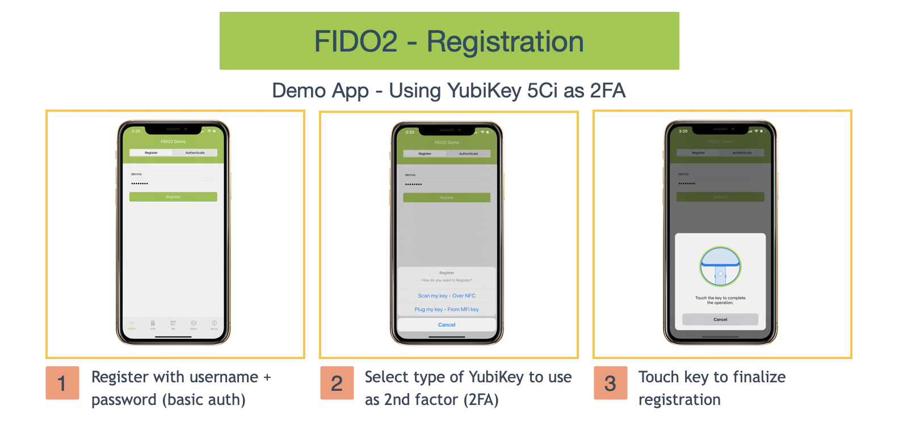

# Welcome to the YubiKit Demo application.

YubiKitDemo application provides demos for most of the functionality of the YubiKey 5Ci and NFC-Enabled YubiKeys. To successfully use this application, you need to be in possession of one of these keys.

Here's a breakdown of the demo functions:

* The **FIDO2 tab** is a demo for FIDO2/CTAP2. Press *Register* on the top and follow the steps to register a test account with basic authentication + YubiKey as 2nd form of authentication (2FA). After registering, try to authenticate with the same basic auth credentials and YubiKey as 2FA by selecting the *Authenticate* tab. In both cases the application will ask to insert the YubiKey to perform the FIDO2 operations as 2FA to basic auth (username + password).

    

* The **OTP tab** is a demo for scanning an OTP over NFC or reading an OTP from a YubiKey 5Ci. To read an OTP press the *Read* button. The application will ask how to read the OTP. When selecting *Scan my key* the application needs a YubiKey with NFC support (YubiKey NEO or YubiKey 5 NFC) to read an OTP from it. Scan the NFC-Enabled key when the NFC scan action sheet is presented. When selecting *Plug my key* the demo application will read an OTP from a YubiKey 5Ci plugged into the Lightning connector.

* The **QR tab** is a demo for the built-in QR code reader from YubiKit. Press scan to scan a QR code with YubiKit.

* The **Other tab** is a collection of small or more concise demos (like the demos for the RawCommand service and the PC/SC like interface). This section also offers self-contained FIDO demos for both FIDO2 and FIDO U2F.

## Get Started

1. Clone this repo from Mac Terminal
```git
 $ git clone https://github.com/Yubico/yubikit-ios.git
```
2. Launch the project in Xcode (11+) 
```git
 $ cd YubiKitDemo
 $ open YubiKitDemo.xcodeproj
```
3. Build and Run the YubiKitDemo on a real device